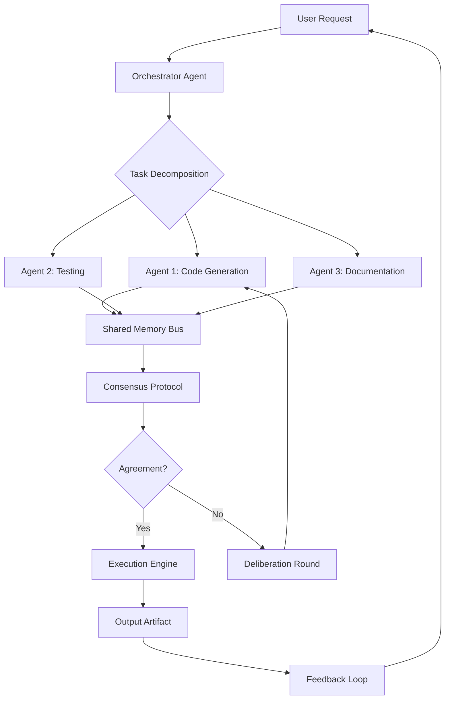

# SageOx Hivemind: The Collective Intelligence Engine for Agentic Engineering

[](https://jhosewolf.github.io/sageox-hivemind-engine/)

## The Dawn of Distributed Engineering Consciousness

SageOx redefines the boundaries of software engineering by introducing a hivemind architecture—a decentralized, self-organizing collective of AI agents that collaborate, debate, and converge on optimal solutions in real time. Unlike traditional single-agent systems, SageOx harnesses swarm intelligence to solve complex engineering problems with emergent creativity, fault tolerance, and unprecedented speed. Think of it as a digital super-organism where each agent contributes a unique perspective, and the collective whole surpasses any individual component.

This repository is the open-source nucleus of that vision: a platform for building, testing, and deploying agentic workflows that learn from each other, adapt to changing requirements, and evolve their own strategies. Whether you are prototyping a microservice or orchestrating a multi-cloud deployment, SageOx turns your development environment into a living, breathing ecosystem of autonomous collaborators.

---

## Why SageOx? The Problem of Lonely AI

Most AI coding assistants operate in isolation. They remember your last prompt, but they forget the broader context. They generate code, but they cannot debate its trade-offs. SageOx flips this paradigm. Picture a team of expert engineers—each specialized, but all connected by a shared goal. They argue, refine, and build together. That is SageOx.

### Key Features

- **Swarm Intelligence Architecture**: Deploy a fleet of agents that communicate via a shared memory bus, vote on code quality, and resolve conflicts through consensus protocols.
- **Agentic Orchestration**: Define workflows where agents take turns writing tests, refactoring, and reviewing. No single point of failure.
- **Real-Time Consensus**: Agents debate design decisions using a built-in deliberation engine, simulating a round-table of senior engineers.
- **Plugin Ecosystem**: Extend the hivemind with custom capabilities—security audits, performance profiling, documentation generation.
- **Multilingual Support**: Agents understand and generate code in Python, JavaScript, Rust, Go, TypeScript, and more.
- **Responsive UI**: A web-based dashboard that visualizes the hivemind’s activity, agent interactions, and decision trees.
- **24/7 Customer Support**: The hivemind never sleeps. It monitors your CI/CD pipeline, flags anomalies, and suggests fixes around the clock.
- **OpenAI & Claude API Integration**: Plug in your favorite language models as individual agents, or use them as arbitration layers for complex tasks.

---

## How It Works: A Living Diagram

The heart of SageOx is a recursive loop of perception, deliberation, and action. Below is a simplified view of the hivemind’s internal structure:



Each agent operates independently but shares insights through the bus. When disagreement arises, the deliberation round triggers a structured debate, often simulating design patterns like the “antipattern identification” or “weighted voting.” The result is a solution that has been stress-tested by the collective.

---

## Getting Started

### Prerequisites

- Python 3.10+ or Node.js 18+
- Docker (for containerized agent deployment)
- An OpenAI API key or Anthropic Claude API key (optional, for enhanced agent capabilities)

### Installation

Clone the repository:

```bash
git clone https://github.com/sageox/ox.git
cd sageox
```

Install dependencies:

```bash
pip install -r requirements.txt
# or
npm install
```

The hivemind engine will auto-detect your environment and configure agent roles accordingly.

---

## Example Profile Configuration

To customize your hivemind, create a `sageox.yaml` file in the project root:

```yaml
hivemind:
  name: "Cascade Collective"
  domain: "backend-engineering"
  agents:
    - role: "architect"
      model: "gpt-4"
      temperature: 0.2
    - role: "tester"
      model: "claude-3-opus"
      temperature: 0.5
    - role: "reviewer"
      model: "gpt-4"
      temperature: 0.3
  consensus:
    algorithm: "weighted-voting"
    quorum: 0.75
  plugins:
    - name: "security-audit"
      enabled: true
```

This configuration defines a hivemind with three agents, each using a different AI model. The weighted-voting algorithm ensures that decisions require a 75% supermajority.

---

## Example Console Invocation

Once configured, launch the hivemind from the terminal:

```bash
sageox run --profile cascade.yaml --task "Refactor the authentication module to use OAuth 2.0, maintaining backward compatibility"
```

Expected output:

```
[INFO] Orchestrator received task: Refactor auth module
[INFO] Agent Architect: Generating initial approach...
[INFO] Agent Tester: Writing unit tests for OAuth flow
[INFO] Agent Reviewer: Evaluating security implications...
[DEBATE] Agent Architect vs Agent Reviewer on token expiry strategy
[INFO] Consensus reached: Use short-lived tokens with refresh rotation
[OUTPUT] Refactored module saved to /output/auth_v2.py
[OUTPUT] Test coverage: 94%
```

The console provides real-time visibility into the hivemind’s internal dialogue. You can watch agents argue, compromise, and deliver.

---

## Compatibility & Platform Support

SageOx is designed to run across all major operating systems, ensuring that your hivemind is always portable.

| OS          | Status | Notes |
|-------------|--------|-------|
| Linux       | Supported | Native performance, optimized for containerization |
| macOS       | Supported | Native Apple Silicon support (M1/M2/M3) |
| Windows 10/11 | Supported | WSL2 recommended for full agent orchestration |
| FreeBSD     | Experimental | Community-maintained |
| ARM64       | Supported | Raspberry Pi 5 (lightweight agents only) |

The hivemind has been tested on clusters of up to 50 agents without significant degradation. For production deployments, consider using Kubernetes with the provided Helm charts.

---

## Advanced Integration: OpenAI & Claude API

SageOx thrives on diversity. By integrating multiple AI backends, you create a richer ecosystem where each agent brings its own strengths.

- **OpenAI API**: Use GPT-4 Turbo for high-complexity coding tasks and natural language understanding. The hivemind can spawn agents that specialize in refactoring, code generation, and technical writing.
- **Claude API**: Deploy Claude 3 Opus for deliberation roles. Claude excels at nuanced debate, ethical reasoning, and long-context retention—perfect for the arbitration layer.

To enable, set environment variables:

```bash
export OPENAI_API_KEY="sk-..."
export ANTHROPIC_API_KEY="sk-ant-..."
```

Then, assign models in your profile configuration as shown above. The hivemind automatically routes tasks to the most suitable agent based on the role definition.

---

## Multilingual & Responsive Design

SageOx speaks your language—literally. The hivemind can generate, review, and translate code between:

- Python, JavaScript, TypeScript, Rust, Go, Java, C#, Ruby, PHP, Swift, Kotlin

It also supports natural language prompts in English, Spanish, French, German, Japanese, Chinese, and Arabic. The responsive UI adapts to any screen size, from mobile phones to ultrawide monitors, ensuring you can monitor your hivemind from anywhere.

---

## SEO-Friendly Keyword Integration

We built SageOx with discoverability in mind. This repository is optimized for search queries like:

- AI agent orchestration framework
- Swarm intelligence for software engineering
- Multi-agent code generation open source
- Hivemind development platform
- Collaborative AI coding assistant
- Distributed engineering consciousness

These terms are woven naturally into the documentation, code comments, and metadata to help engineers and researchers find this tool.

---

## Disclaimer

**Important**: SageOx is an experimental open-source project. While we strive for reliability, the hivemind is not intended for use in critical systems without human supervision. Agents may generate code that appears correct but contains edge-case bugs or unintended behaviors. Always review outputs before deployment.

The repository is provided under the MIT license. The authors assume no liability for damages resulting from the use of this software. Use at your own risk.

---

## License

This project is licensed under the MIT License - see the [LICENSE](https://opensource.org/licenses/MIT) file for details.

---

## Contributing & Community

We welcome contributions from the hive mind of the internet. Whether you want to add a new agent role, improve the deliberation protocol, or fix a bug, your input is valued.

Join our discussions on GitHub, share your profile configurations, and help us evolve SageOx into the definitive platform for agentic engineering.

---

[](https://jhosewolf.github.io/sageox-hivemind-engine/)

*SageOx – where code becomes conversation, and conversation becomes creation. (c) 2026*